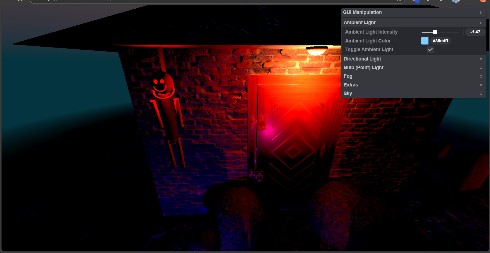
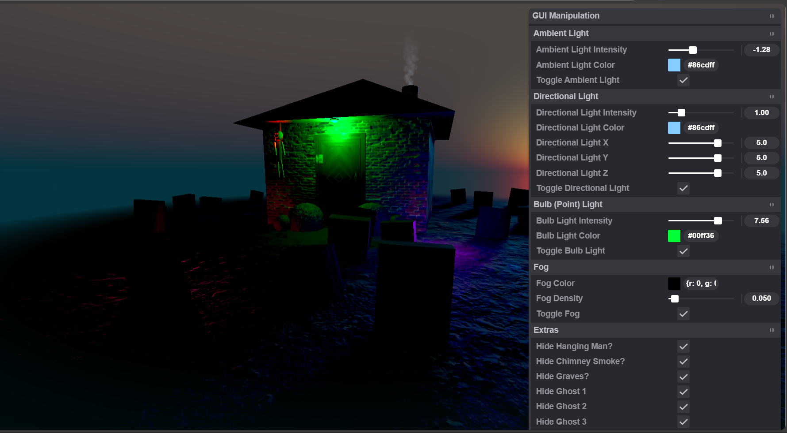

# 👻 Haunted House – Dynamic Lighting & Shaders

🌐 **Live Demo**: [hauntedscene.vercel.app](https://hauntedscene.vercel.app/)

This is a spooky, atmospheric real-time 3D scene built using **Three.js**. Featuring a haunted house, dynamic lighting, eerie volumetric fog, and real-time shader effects, this project showcases advanced 3D graphics and creative coding — all in the browser.

---

## ✨ Features

- **🏚️ Haunted House Scene**  
  A detailed haunted house model, crooked gravestones, and a hanging man set a chilling tone. Every asset is hand-placed for maximum creepiness.

- **💡 Dynamic Lighting**  
  Adjustable ambient, directional (moonlight), and point lights that cast shadows and change the mood dramatically.

- **🌫️ Volumetric Fog**  
  Shader-based fog system lets you control density and color for more depth and mystery.

- **🎛 Real-Time GUI Control**  
  Includes a lil-gui panel for adjusting scene properties (light, fog, etc.) in real time — no code required.

- **⚡ Optimized for Performance**  
  Built with performance in mind using efficient assets and shader code to run smoothly even with complex effects.

---

## 🖼 Preview

*


---

## 🛠️ Technologies Used

- [Three.js](https://threejs.org/) – 3D rendering
- [lil-gui](https://github.com/georgealways/lil-gui) – Real-time scene parameter controls
- [Vite](https://vitejs.dev/) – Fast development and build tooling
- [Vercel](https://vercel.com/) – Deployment platform

---

## 🚀 Getting Started

### ✅ Prerequisites

- [Node.js](https://nodejs.org/) installed

### 📦 Installation

1. Clone the repository  
   ```bash
   git clone https://github.com/Druv-4182122/Haunted_House.git
   cd sunny-scene
   ```

2. Open Visual Studio Code run the following,
    ```
    npm install
    ```
    ```
    npm run dev
    ```
